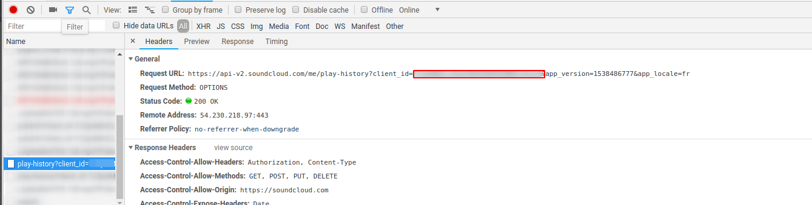

Soundnode App
============

Soundnode App is an Open-Source project to support Soundcloud for desktop Mac, Windows, and Linux.  
It's built with Electron, Node.js, Angular.js, and uses the Soundcloud API.

> Be aware that Soundnode relies on Soundcloud API which only allows third party apps to play 15 thousand tracks daily. When the rate limit is reached all users are blocked from playing/streaming tracks. The stream will be re-enable one day after (at the same time) streams were blocked.

Follow us on twitter for updates [@Soundnodeapp](https://www.twitter.com/soundnodeapp).

Featured on [Producthunt](https://www.producthunt.com/tech/soundnode-2), [TNW](http://thenextweb.com/apps/2016/01/25/soundnode-is-the-soundcloud-desktop-app-youve-been-waiting-for/#gref)
and [Gizmodo](http://gizmodo.com/soundnode-turns-soundcloud-into-a-spotify-like-desktop-1754953529)

## Features

- No need to install
- Native media keyboard shortcuts
- Search for new songs
- Easy navigation
- Listen to songs from your Stream, Likes, Tracks, Following or Playlists
- Like songs and save to your liked playlist
- Full playlist feature
- Follow/Unfollow users

And much more!

## Configuration

Since soundcloud applies a rate limit to third party apps, you need to configure your own API key to make soundnode work.

Unfortunately soundcloud suspended new application creation, so to retrieve your api key, you have to dig into the soundcloud [website](https://soundcloud.com/).

* Login to soundcloud.com on favorite browser
* Look for an api call and write down the client_id parameter

* Edit your userConfig.json file (see here for location : https://github.com/eliecharra/soundnode-app/blob/master/app/public/js/common/configLocation.js#L34) and update clientId parameter with the previously retrieved one.

## How to contribute

First, building, testing, and reporting bugs is highly appreciated. Please include the console's output and steps to reproduce the problem in your bug report, if possible.

If you want to develop, you can look at the issues, especially the bugs, and then fix them.
Here's a [list of issues](https://github.com/Soundnode/soundnode-app/issues?state=open).

Please follow the [contribution guidelines](https://github.com/Soundnode/soundnode-app/blob/master/CONTRIBUTING.md).

## Development

See the [Development page](https://github.com/Soundnode/soundnode-app/wiki/Development) for a complete guide on how to build
the app locally on your computer.

Check out [Electron documentation](https://electron.atom.io/docs/)

## Supported Platforms

- Windows
- Mac
- Linux

## Author

- [Michael Lancaster](https://github.com/weblancaster)

## Contributors

Thanks to all [contributors](https://github.com/Soundnode/soundnode-app/graphs/contributors) that are helping or helped making Soundnode better.

## License

GNU GENERAL PUBLIC LICENSE Version 3, 29 June 2007 [license](https://github.com/Soundnode/soundnode-app/blob/master/LICENSE.md).
